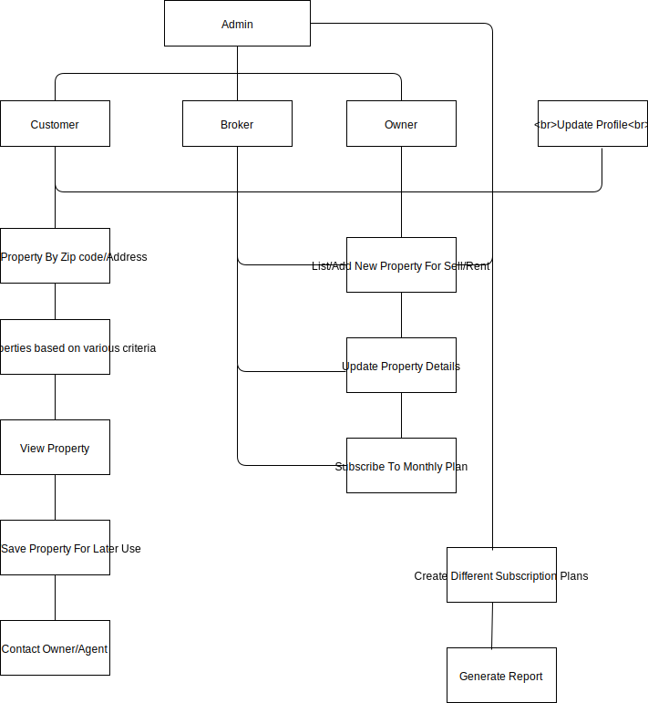

## Webtech Group - Final Project

### User Stories:

1) As a user I should be able to Sign-up with  email ID
2) As a user, I should be able to Log-In using my email ID and Password or facebook/G+ account
3) As a user/broker/owner I should be able to log-out
4) As a user/broker/owner I should be able to see the Property Search Screen/Home Screen
5) As a user/broker/owner I should be able to select Rent or Buy property
6) As a user/broker/owner I should be able to see property for the entered zip-code/address
7) As a user/broker/owner I should see appropriate alerts if property is not available for the entered zip-code/Address
8) As a user/broker/owner I should be able to search on selected filter options 
9)  As a user/broker/owner I should be able to see the Search result
10) As a user/broker/owner I should be able to select the Property from search result and see Property details
11) As a user/broker/owner I should be able to contact the Broker/Owner of the selected property
12) As a user/broker/owner I should be able to save the property for later review
13) As a user/broker/owner I should be able to see the property on the Map
14) As a user/broker/owner I should be able to share the property link with my friends and family.
15) As a user/broker/owner I should be able to add/edit/update my Profile details
16) As a Broker/Owner I should be able to sign-up using email Id and Password
17) As a Broker/Owner I should be able fill my Business details ex. Business Name, Address, Phone# etc
18) As a broker/owner I should be able to verify my email-Id 
19) As a broker/owner I should be able to log-in using email-Id and password
20) As a broker/owner I should be able to list properties for sale/rent
21) As a broker I should be able to add property details
22) As a admin, I should be able to delete the fake accounts
23) As a admin, I should be able to do bulk upload for brokers
24) As a admin I should be able to set the subscription price points for the Brokers/Owners
    Eg. 0-10 Property Listing -  free 
   10-50 Property Listing - $50/mo
   50-100   Property Listing - $75/mo
   100-500   Property Listing - $150/mo
25) As a admin, I should be able to disable accounts  for brokers/owners with expired Subscriptions

### Domain Driven Design Model:

